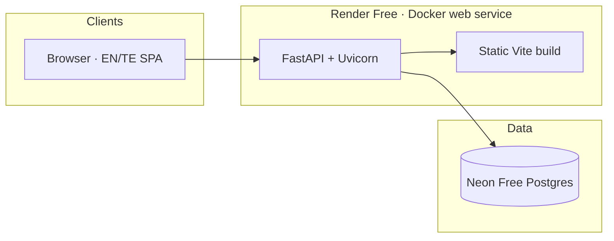
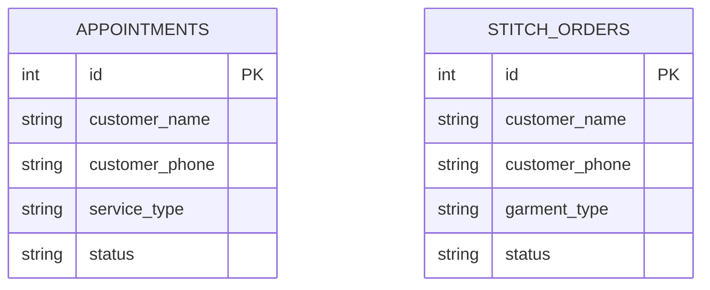

# Architecture

Ruhi's Boutique is a single-store fashion boutique site for **KPHB 7th Phase, Kukatpally**. Customers book visits or request custom stitching; boutique staff manage requests from a PIN-locked admin desk.

## System overview

| Layer | Technology |
|-------|------------|
| Frontend | React 19, Vite 8, TypeScript, CSS (`apps/web`) |
| Backend | FastAPI, SQLAlchemy 2, Pydantic 2 (`apps/api`) |
| Database | Neon Postgres (prod) · SQLite (local default) |
| Hosting | Render Free Docker service (Oregon) |

## Domain model

**Appointment status:** `new` · `confirmed` · `completed` · `cancelled`  
**Stitch order status:** `new` · `measuring` · `stitching` · `ready` · `delivered` · `cancelled`

## Frontend portals

| Portal | Purpose |
|--------|---------|
| `home` | Marketing, collections preview, CTAs |
| `collections` | Full collections list |
| `about` | Address, map, Justdial, WhatsApp |
| `book` | Visit booking form |
| `stitch` | Custom stitching request form |
| `admin` | PIN desk: appointments, orders, visit analytics |
| `privacy` | Privacy policy |

## Configuration

| Variable | Required in prod | Purpose |
|----------|------------------|---------|
| `DATABASE_URL` | Yes | Neon pooled Postgres URL |
| `ADMIN_PIN` | Yes | Admin desk unlock (8+) |
| `APP_URL` | Recommended | Public site URL |
| `PORT` | Injected by Render | Listen port |
